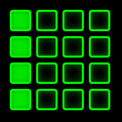

# BeatViz

Author: Steven Yi\<stevenyi@gmail.com\>

A program for visualizing beat groups.

</img>

## About 

BeatViz shows a 4x4 grid that represents groupings of ticks, beats, bars, and phrases. (Tick here meaning a single 16th note, as used within the [Csound Live Code](https://github.com/kunstmusik/csound-live-code) system.) The grid updates as follows:

1. The top row ticks every sixteenth-note (4 ticks).
2. The second row ticks every 4 sixteenth-notes and represents quarter-notes (4 beats).
3. The third row ticks every 4 beats and represents a bar or measure (4 bars).
4. The fourth row ticks every 4 bars (4 phrases).

## Usage

* BeatViz requires [Java](http://java.oracle.com).
* To run BeatViz, double-click the BeatViz.jar file or use ```java -jar BeatViz.jar``` in a terminal. The program will open up the visualizer in the lower right-hand corner of the primary screen.
* The program is hard-coded to listen to UDP messages on port 9228. BeatViz will read in messages as strings then parse the string as a long integer and use that number as the current tick. While the program was built for the author's use with the [Csound Live Code](https://github.com/kunstmusik/csound-live-code) system, it may be used by any program that can send UDP messages.
* To close the program, triple-click the beat grid visualizer. 
* To move the visualizer location, click on the visualizer once to focus input on it, then use the arrow keys on a keyboard to move the visualizer up, down, left, or right by 10 pixels. 
